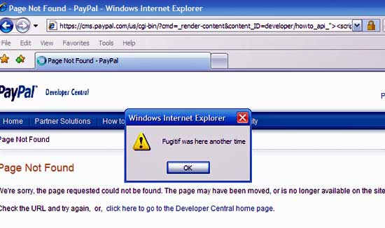

## [fit] `String`
## [fit] is not a sufficient type

### …how type systems can help you make better software

---

^ Who am I?

## About Me

- Chris Dzombak
- iOS Frameworks Team
- dzombak@nytimes.com
- @dzombak on Slack
- @**c**dzombak on Twitter

---

## Relax.

^ FYI: this talk isn’t going to provide hard, actionable information, and there’s no need to take notes. This is just some food for thought.

---

## Let’s talk about `String`.

^ We use this basic type, String, to represent all sorts of things in our applications.

---

- user input
- human language words
- output for the UI
- SQL statements
- keypaths for Cocoa KVO/KVC
- …

---

- …
- XPath queries for XML
- shell commands
- HTML
- regular expressions
- and more!

---

## `String` is totally insufficient to represent all these different things

^ `String` by itself is completely insufficient for representing all these things.

^ They all have vastly different meanings and uses,
operations you can do with one aren’t necessarily valid for the others,
and you generally should not be able to combine these things.

^ In fact, using just `String`,
which _does_ allow mixing these different types of strings,
leads to a lot of really common security vulnerabilities and other user-facing problems.

^ Let's review some of these common issues…

---

## Documentation


^ Using `String` for Cocoa's key-value coding and key-value observing keypaths means programmers have to fill in missing documentation in their own code, with careful naming, to keep their APIs useful.

^ This is a screenshot from Swift's API design guidelines that illustrates a larger problem with vanilla Strings.

---

## SQL Injection

```sql
SELECT * FROM items 
WHERE owner = 'hacker'
AND itemname = 'name';

DELETE FROM items;
--'
```

^ Since everything is just a `String`, the compiler or runtime can't complain if you try to concatenate two strings that really should not be allowed to be combined.

---

## Shell Injection
 
```ruby
run("gpg" , "−−trust−model always −o
    \"#{File.expand_path(dst.path)}\" −e −r \"#{@recipient}\"
    \"#{File .expand_path(src .path)}\"")
```

_Code sample from the 2010 DC online voting pilot[^1]._

[^1]: https://jhalderm.com/pub/papers/dcvoting-fc12.pdf
https://freedom-to-tinker.com/blog/jhalderm/hacking-dc-internet-voting-pilot

^ This code sample is from from Washington, DC's online voting pilot program in 2010; this vulnerability was discovered by some researchers at UMich (go blue!).

^ Simply concatenating strings results in an attacker-controlled filename being passed to the shell, allowing for arbitrary command execution.

---

## Messy UI failure modes


^ Rendering arbitrary strings to the UI, without sanely parsing or sanitizing them, leads to "NaN" and "null" showing up in lots of places they shouldn't.

---

## XSS



^ This is an all-too-familiar sight in the Web programming world.

^ This vulnerability comes from combining attacker-controlled strings into your user interface, without sanitizing them first.

^ You shouldn't even be allowed to do that. That is never correct. But current web framework tooling doesn’t enforce that for you.

---

## What if we used different `String` types for…

- user input
- HTML output
- SQL statements
- shell commands
- etc…

^ (and other string-y things.)

---

```
let username = inputUsername()

let sql: SQLString = "SELECT FROM `users` WHERE `name` = '" + username + "';"
database.execute(sql)
```

^ This would prevent us from, for example, mixing a user-input string directly into a SQL statement without escaping it first.

---

```
let username = inputUsername()

let sql: SQLString = "SELECT FROM `users` WHERE `name` = '" + username + "';"
> error:                                                   ^^^
> error: cannot combine `username` of type UserInputString with type SQLString
```

^ In fact, the compiler, or runtime, would prevent this from ever happening.

^ The same sort of error would happen if you tried to use an unsanitized string as part of an HTML template, or as part of a shell command.

^ Just like that, actually using the type system would let us eliminate whole classes of security problems.

---

## I’m not crazy.

^ This sounds really unusual, and it's different from how most languages & frameworks have historically done things.

^ But it's really, really not crazy at all.

^ Let’s think back to doing math in our high school physics and chemistry classes.

---

## 43,560

^ This number doesn't mean much.

---

## 43,560

## 43,560 ft²

^ Ah, here we go.

^ The first number, we know is a number, but we don't know anything else about it.

^ The second number, we actually know what it represents.

^ Doing math with the first number here is like working with the `String` type everywhere. You can hopefully keep track of what each variable represents and what you need to do with it to get the right answer.

^ But the second number has a _unit_ attached. We know what it means. And we can take advantage of that to ensure we use it properly in our calculations.

---

## Units in math are just like your type system.

^ Units from math are just like your type system.

---

## Units in math are just like your type system.


^ Just like a type system, units let you check that you're using your variables properly, not skipping any crucial steps or adding any incorrect steps.

---

### Exactly like in high school physics, we should attach meangingful information to our strings.

^ So, this isn’t crazy.

^ I’m just proposing that, exactly like in high school physics, we should attach meangingful information to our strings, via the type system.

---

### Exactly like in high school physics, we should attach meangingful information to our strings.

### Then, our compiler or runtime will make many common mistakes impossible.

---

## What would it take to really do this?

^ Really, we don't need very much to make this work.

^ We just need a language's standard library, and things like templating and database libraries, to provide a couple customized `String` types, and functions for converting between them safely.

^ Let's review what this could look like.

---

## Standard library

- `String`
- `UserInputString`
- `PathString` and `URLString`
	- (or maybe filesystem paths and URLs should be represented by separate, more capable objects entirely)

^ We just need some basic types from the standard library to get us started.

---

## Native UI library

- `UserFacingString`
- A function accepting `String`s, numbers, null references; filtering them; and outputting a “sane” string

^ Your UI library should define a “User Facing String” type, and should only accept this type for presentation to the user.

^ The only way to build one of these user facing strings should be a function, or set of functions, which can accept other `String`s, numbers, possibly-null pointers, and the like; and will only output “sane” strings for display—not “null” or “NaN”.

^ Since your user interface layer only accepts these “sane” strings, boom, no more “NaN”s in your UI.

---

## Web templating library

- `HTMLEscapedString`
- A function accepting other `String`s and escaping them for output

^ A web templating library should provide some sort of “escaped HTML string” type, and it should only allow combining this type into HTML output.

^ Building one of these escaped strings would be accomplished with some function that takes `String`s and escapes them for HTML output.

^ You’ll note that that function is already provided in basically any web framework; we just need to constrain the type of string accepted by templates, so you can _only_ use escaped strings in your output.

^ And that eliminates common cross-site scripting vulnerabilities.

---

## Database library

- `SQLStatement`, `SQLEscapedString`
- `SQLStatement` may only be constructed from programmer-controlled origins
- Only `SQLEscapedString` may be combined into `SQLStatement`, in predefined safe ways
- A function accepting `String`s and escaping them for SQL

^ A database library should provide a “SQL statement” type and an “escaped SQL string” type.

^ The origins for SQL statements should be carefully policed to include only programmer-controlled string literals, not “user input strings”. And then, only “SQL escaped strings” should be allowed to be combined into SQL statements, in predefined and safe ways.

^ Building an escaped string would be accomplished with some function that takes `String`s and escapes them for inclusion in a SQL statement.

^ That function is already provided in basically any database library; we just need to constrain the type of string that you can actually send to the database, so you can _only_ use escaped strings in queries.

^ This system would eliminate common SQL injection vulnerabilities.

---

## Cocoa KVC/KVO

- `KeyPath`
- `addObserver:forKeyPath:…` et al. accept `KeyPath`
- Build `KeyPath` from string literals, with validation
- Build `KeyPath` from runtime reflection
- `KeyPath` instances can only be manipulated in constrained, valid ways

^ To support key-value coding and key-value observing on iOS/OS X, we'll introduce a `KeyPath` type to represent keypaths, instead of relying on String. (This is very roughly analogous to an XPath or LINQ query.)

^ Key-value observing and key-valid coding APIs then will accept this `KeyPath` type, not just any String.

^ `KeyPath`s could be built from string literals embedded in the code, with some validation logic attached. The compiler could even check their validity ahead of time.

^ Maybe you could also get a `KeyPath` from reflection at runtime.

^ And finally, you can only manipulate and combine `KeyPath`s in constrained, safe, valid ways.

^ So those are some examples of how this kind of safety could be implemented.

---

## [fit] This sounds hard 😰

^ At this point, you may be thinking, “this sounds hard”, or “this sounds like pointless busy work”.

^ That’s okay…but it actually wouldn’t be hard. At all.

---

## [fit] This sounds hard 🤔


^ Think back to when you were first learning to use dimensional analysis to convert between units in physics or chemistry.

^ At first, this seemed like busy work, and it seemed hard.

^ Then, hopefully, you realized: it’s actually not busy work at all, and it’s not hard. We were doing the same calculations either way, but writing out units like this helps us keep track of our work and catch mistakes.

^ What I am psoposing here is _exactly the same_. In fact…

---

### Using plain old `String` everywhere in your program is like a professional physicist foregoing units in their calculations.

^ If a physicist or a drug development chemist didn’t use units in their calculations—if they just treated all their variables as plain old numbers—we’d think they were irresponsible and they’d probably be fired.

^ Using `String` everywhere, instead of using more constrictive types to help us catch errors, is _exactly the same:_ it’s irresponsible.

---

### This is work we’re doing already.

^ As programmers, we are already keeping track of user input, sanitizing it before passing it to the user interface or an HTML template or the database, and checking results for `null` before we present them in the user interface.

---

### This is work we’re doing already.

### Except when we forget.

^ Except that it’s really hard to keep all that metadata about our `String` variables in our heads, and sometimes we make mistakes. And when we do, we create a security vulnerability or a poor user experience.

^ I’m just proposing that we use tools that already exist, to catch mistakes in work we’re already doing. That doesn’t seem onerous to me.

---

## This is work we’re doing already.

- `ESAPI.encoder()`
- `mysql_real_escape_string`
  (yes, I know it’s deprecated)
- Escaping shell metacharacters[^2]
- `label.text = name.length ? name : ""`

[^2]: http://stackoverflow.com/a/20053121

^ The filtering and processing functions I proposed earlier already exist. We are already using them—or we’re supposed to be, anyway.

^ We just need to add a few new `String` types to represent the different kinds of inputs and outputs for these functions, and then constrain APIs to only accept the correct kind of `String`.

---

## Implementation?

^ For this talk, I don’t care about how this gets implemented.

---

## Implementation?

## ¯\\\_(ツ)\_/¯

^ You could use subclasses for all I care; you could use protocols or interfaces, or a clever composition-based solution.

^ But all I am discussing here is what our _interfaces_ should look like, and how those interfaces should interact; I don’t particularly care how this gets implemented.

^ That said, let me wrap up.

---

## Conclusions

### Type systems exist and we should let them help us. ✅

^ Type systems exist for a reason, and we’re ignoring them when it comes to strings. We should let our tools help us avoid mistakes.

---

## Conclusions

### A few new types would help eliminate whole classes of vulnerabilities and other bugs. ✅

^ Introducing a few more types to our libraries would prevent several classes of really common security vulnerabilities and user-facing bugs.

---

## Conclusions

### This wouldn’t be hard or annoying; this is work we’re already doing. ✅

^ Since these are checks and conversions that we're supposed to remember anyway, it wouldn't be more annoying than software development is today.

^ This would just allow our tools to catch our mistakes—exactly the way that using units in our math in physics and chemistry helps us catch mistakes there.

---

## Discussion

^ That’s all I have. Rather than doing a formal Q&A, I thought we should open the floor to discussion.

---
